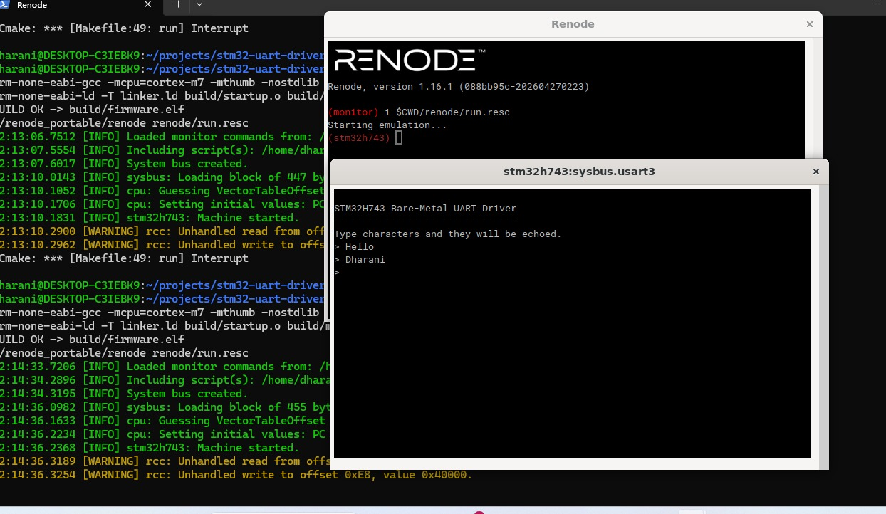

# Bare-Metal STM32H743 UART Driver

A USART driver for the STM32H743ZI written from scratch using only the
reference manual. **No HAL, no Zephyr, no vendor libraries.** Built and
verified in the Renode simulator — runs without physical hardware.



---

## What this project demonstrates

- Direct memory-mapped register access using `volatile` pointers
- The three-step peripheral bring-up pattern: clock enable, pin mux, peripheral configuration
- Polled UART transmit and receive using TXE and RXNE status flags
- Hand-written ARM Cortex-M startup file (vector table, reset handler, default handler)
- Hand-written linker script with custom memory regions and stack pointer placement
- Renode-based simulation for firmware validation without hardware
- Make-driven build system with incremental compilation

## Hardware target

- **MCU:** STM32H743ZI (ARM Cortex-M7)
- **Board model:** Nucleo-H743ZI
- **Peripheral:** USART3 routed through the on-board ST-Link virtual COM port

## Repository layout

```
stm32-uart-driver/
  include/
    stm32h7_regs.h      Minimal register map (only what we use)
    uart_driver.h       Public driver API
  src/
    startup.s           Hand-written ARM startup (vector table, reset handler)
    uart_driver.c       Driver implementation
    main.c              Application: banner + echo loop
  renode/
    run.resc            Renode simulation script
  linker.ld             Memory layout for STM32H7 flash and RAM
  Makefile              Build automation
```

## How to build and run

### Prerequisites

- ARM cross-compiler: gcc-arm-none-eabi
- GNU Make
- Renode simulator (for running without hardware)

On Ubuntu / WSL:

```bash
sudo apt install gcc-arm-none-eabi make
```

Renode portable build can be downloaded from [renode.io/builds](https://builds.renode.io/).

### Build

```bash
make
```

This produces build/firmware.elf, ready to load into Renode or flash to a real board.

### Run in Renode

```bash
make run
```

Renode opens with a USART3 analyzer window. The firmware prints a banner and enters an echo loop — characters typed in the analyzer are echoed back by the firmware running on the simulated CPU.

### Clean

```bash
make clean
```

## Driver API

```c
void uart_init(void);
void uart_send_char(char ch);
void uart_send_string(const char *str);
char uart_receive_char(void);
```

All functions are blocking (polling-based). An interrupt-driven version with a circular RX buffer is on the roadmap.

## What I learned building this

### volatile is not optional for hardware registers

I tested this empirically. I wrote a small loop incrementing a counter 10 times, then compiled it four ways:

| Setting | Loop survives? |
|---|---|
| volatile + -O0 (no optimization) | Yes |
| no volatile + -O0 | Yes |
| volatile + -O2 (optimized) | Yes |
| **no volatile + -O2** | **No — entire loop replaced with return 10** |

In the dangerous case, the optimizer realized the loop result was constant and erased it. For hardware register polling (e.g. waiting on USART3_ISR.TXE), the same optimization would result in an infinite loop reading a cached value. This is why every register access in stm32h7_regs.h uses volatile.

### The three-step peripheral bring-up pattern

Every peripheral I work with on STM32 follows the same sequence:

1. **Enable the clock** in the relevant RCC register
2. **Configure the GPIO pins** (alternate function mode, AF number)
3. **Configure the peripheral** (control registers, baud rate, enable bits)

Skipping step 1 is the #1 most common bring-up bug on STM32. Reading or writing to a peripheral whose clock is disabled returns zero or does nothing.

### What runs before main() on a bare-metal MCU

When the Cortex-M7 powers on:

1. It reads the first 4 bytes of flash and loads them as the initial stack pointer
2. It reads the next 4 bytes and jumps to that address (the reset handler)
3. The reset handler optionally copies .data from flash to RAM, zeroes .bss, then calls main()

The vector table at 0x08000000 is the data structure that defines this boot process. I wrote my own minimal version (4 entries) to understand the mechanism — production STM32H7 startup files have 240+ entries for every interrupt source.

## Roadmap

- [x] Polling-based TX and RX
- [x] Renode simulation script
- [x] Hand-written linker script and startup file
- [x] Makefile build system
- [x] Echo loop 
- [ ] Interrupt-driven RX with circular buffer
- [ ] DMA-based TX
- [ ] Hardware verification on physical Nucleo-H743ZI

## License

MIT — see [LICENSE](LICENSE) for details.

## Author

**Dharani K** — Embedded & Firmware Engineer
[LinkedIn](https://www.linkedin.com/in/dharani-kumaresan-embedded/) · [GitHub](https://github.com/Dharani-K-Dev)
